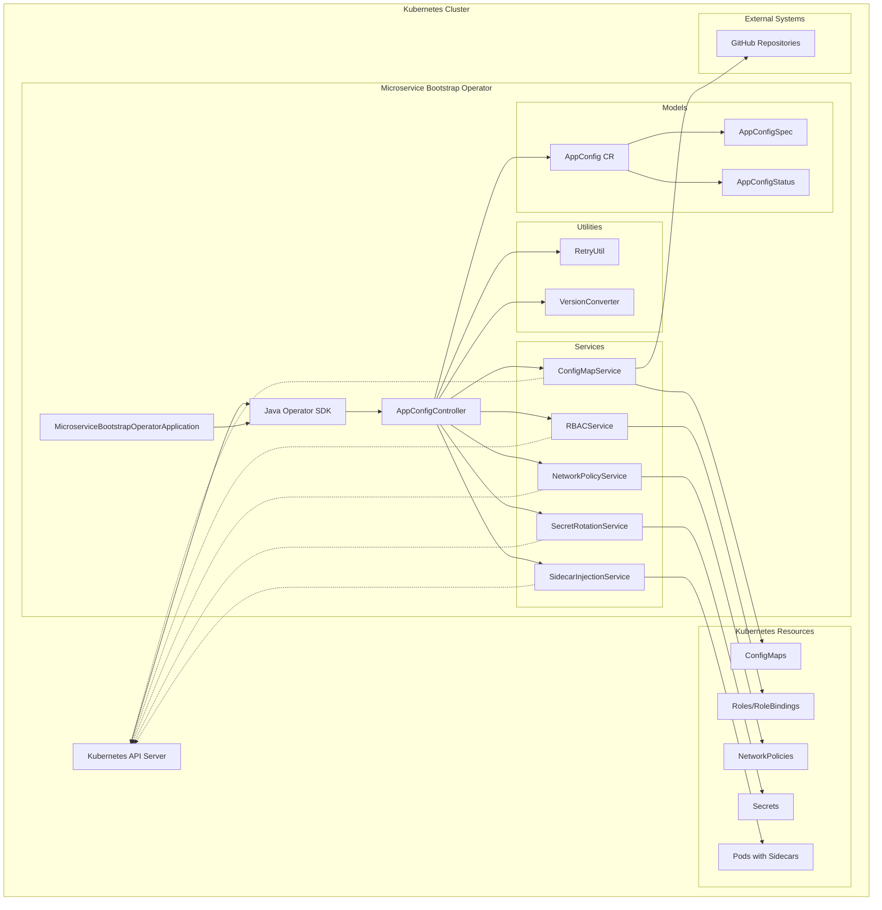
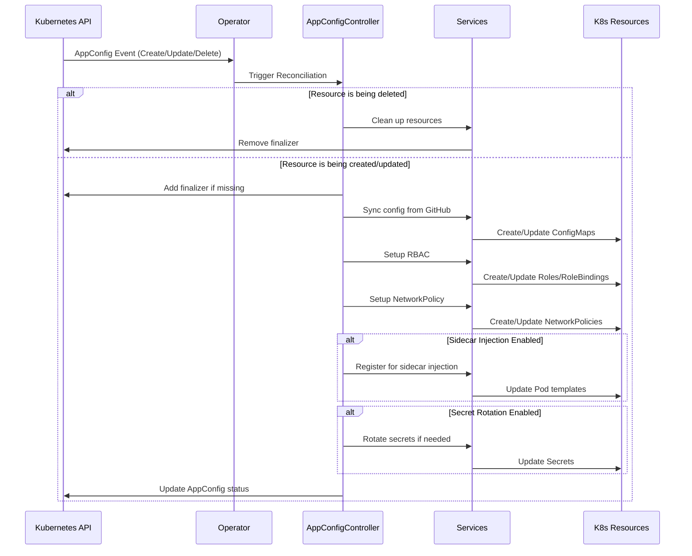
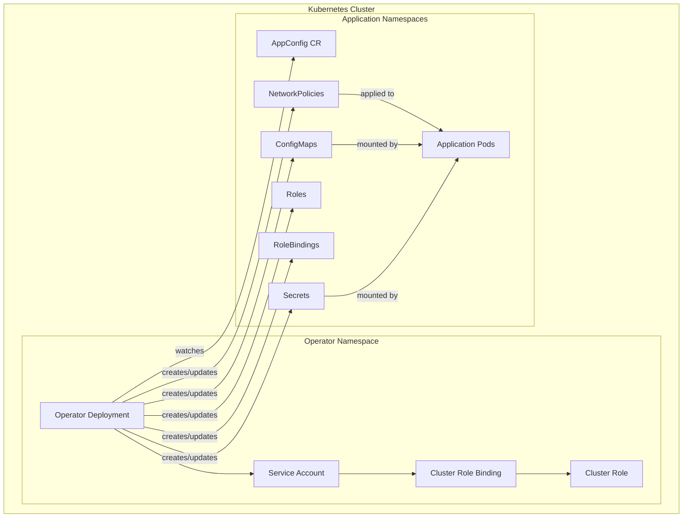

# Microservice Bootstrap Operator Architecture

This document provides an overview of the Microservice Bootstrap Operator architecture, including its components, interactions, and workflows.

## Architecture Overview

The Microservice Bootstrap Operator follows the Kubernetes Operator pattern, using the Java Operator SDK to watch for AppConfig custom resources and reconcile the desired state with the actual state in the cluster.

## Component Descriptions

### Core Components

- **MicroserviceBootstrapOperatorApplication**: The Spring Boot application entry point that initializes and starts the operator.
- **Java Operator SDK**: Provides the framework for watching Kubernetes resources and triggering reconciliation.
- **AppConfigController**: The main controller that implements the reconciliation logic for AppConfig resources.

### Services

- **ConfigMapService**: Syncs configuration from GitHub repositories and creates ConfigMaps in the cluster.
- **RBACService**: Creates and manages RBAC resources (Roles, RoleBindings) based on AppConfig specifications.
- **NetworkPolicyService**: Creates and manages NetworkPolicy resources to control pod communication.
- **SecretRotationService**: Handles automatic rotation of secrets based on configured strategies and schedules.
- **SidecarInjectionService**: Manages sidecar injection into pods based on label selectors.

### Models

- **AppConfig**: The custom resource definition that users create to define their microservice configuration.
- **AppConfigSpec**: Contains the specification for the AppConfig resource.
- **AppConfigStatus**: Tracks the status and conditions of the AppConfig resource.

### Utilities

- **RetryUtil**: Provides retry mechanisms for operations that might fail temporarily.
- **VersionConverter**: Handles version conversion for AppConfig resources.

## Workflow

1. The operator watches for AppConfig custom resources in the cluster.
2. When an AppConfig is created, updated, or deleted, the AppConfigController's reconcile method is called.
3. The controller checks if the resource is being deleted and handles cleanup if necessary.
4. For new or updated resources, the controller:
   - Adds a finalizer to prevent premature deletion
   - Checks and converts the resource version if needed
   - Syncs configuration from GitHub repositories
   - Sets up RBAC resources
   - Creates NetworkPolicy resources
   - Registers the AppConfig for sidecar injection if enabled
   - Handles secret rotation based on the configured strategy
5. The controller updates the AppConfig status with the reconciliation results.

## Reconciliation Loop

## Deployment Architecture

This architecture provides a comprehensive view of how the Microservice Bootstrap Operator works, from the high-level components to the detailed reconciliation workflow.
